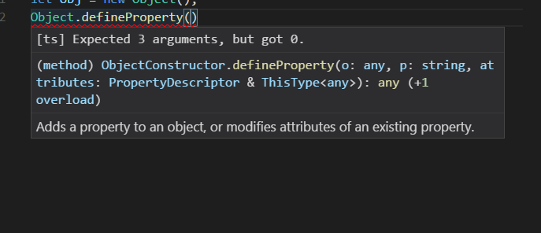
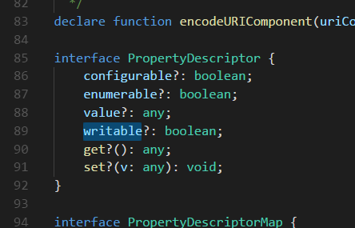

# 对象 Object


在javascript中创建对象

```js
let obj = {};
let obj2 =new Object();
let obj3=Object.create();

//赋值
obj.name= 'jay';


// 删除属性
delete obj.name; 
```

在javascript,Object对象可以定义对象,同时定义对象的属性修饰符





```javascript
Object.defineProperty(obj,name,{
    writable:true,
    configurable:true,
    enumerable:true,
})

```


# 函数 Function
javascript函数是一等公民(first function  class),函数不仅可以调用,可以作为参数和返回值


在javascript中修改函数this的三个方法call,apply,bind
```ts
function Say(age:number){
    console.log(this.name,age);

}

var obj1={name:'obj1'}
// 第二个参数是函数执行的参数数组
Say.apply(obj1,[23])

// 第二个,第三个参数,..... 后面所有参数是函数的执行参数
Say.call(obj1,23)
// bind返回的是改变this对象后的函数
Say.bind(obj1)(23)


```

